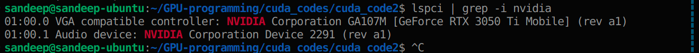
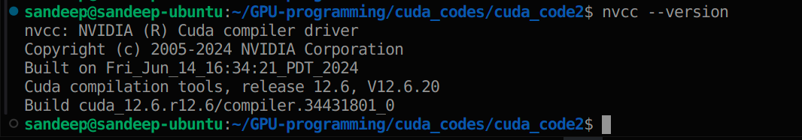
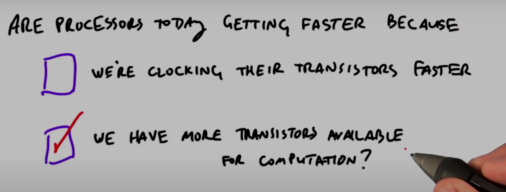
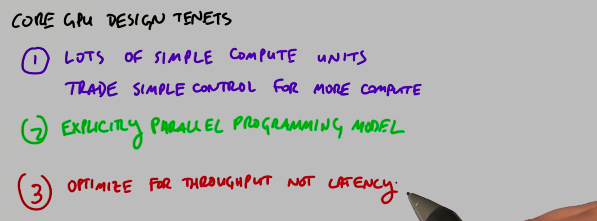
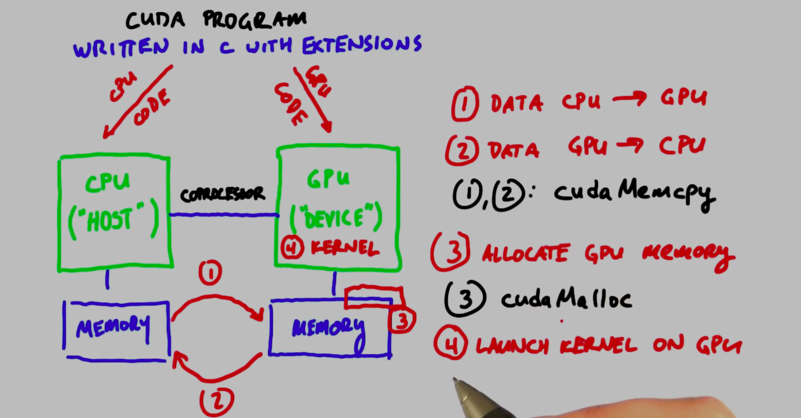

# GPU-programming

Welcome to my GPU Programming Repository! 🚀 This collection showcases my journey through GPU programming, including code snippets, detailed notes, coursework, and exciting experiments. 💻✨ Dive into a world of parallel computing and explore how GPUs can transform complex computations into efficient solutions. Whether you're here to learn or collaborate, there's something for everyone. Happy coding! 🎉👨‍💻👩‍💻

# Notes

- To know the architecture of your system
  $uname -m 
- lsb_release -a (will give you your linux version)
- lspci | grep -i nvidia <br/> (to know the nvidia GPU version) <br/>  
- To know nvcc version <br/> 
- **Cuda and nvcc**
  - **CUDA:** A parallel computing platform and programming model by NVIDIA for using GPUs for general-purpose computing.
  - **nvcc:** The NVIDIA CUDA Compiler used to compile CUDA code into executable binaries.
- To get device info, run deviceQuery <br/>
  sandeep@sandeep-ubuntu:~/GPU-programming$ ./cuda-samples-master/Samples/1_Utilities/deviceQuery/deviceQuery <br/>
  ```
	./cuda-samples-master/Samples/1_Utilities/deviceQuery/deviceQuery Starting...

	 CUDA Device Query (Runtime API) version (CUDART static linking)

	Detected 1 CUDA Capable device(s)

	Device 0: "NVIDIA GeForce RTX 3050 Ti Laptop GPU"
	  CUDA Driver Version / Runtime Version          12.6 / 12.3
	  CUDA Capability Major/Minor version number:    8.6
	  Total amount of global memory:                 3799 MBytes (3983802368 bytes)
	  (020) Multiprocessors, (128) CUDA Cores/MP:    2560 CUDA Cores
	  GPU Max Clock rate:                            1695 MHz (1.70 GHz)
	  Memory Clock rate:                             6001 Mhz
	  Memory Bus Width:                              128-bit
	  L2 Cache Size:                                 2097152 bytes
	  Maximum Texture Dimension Size (x,y,z)         1D=(131072), 2D=(131072, 65536), 3D=(16384, 16384, 16384)
	  Maximum Layered 1D Texture Size, (num) layers  1D=(32768), 2048 layers
	  Maximum Layered 2D Texture Size, (num) layers  2D=(32768, 32768), 2048 layers
	  Total amount of constant memory:               65536 bytes
	  Total amount of shared memory per block:       49152 bytes
	  Total shared memory per multiprocessor:        102400 bytes
	  Total number of registers available per block: 65536
	  Warp size:                                     32
	  Maximum number of threads per multiprocessor:  1536
	  Maximum number of threads per block:           1024
	  Max dimension size of a thread block (x,y,z): (1024, 1024, 64)
	  Max dimension size of a grid size    (x,y,z): (2147483647, 65535, 65535)
	  Maximum memory pitch:                          2147483647 bytes
	  Texture alignment:                             512 bytes
	  Concurrent copy and kernel execution:          Yes with 2 copy engine(s)
	  Run time limit on kernels:                     Yes
	  Integrated GPU sharing Host Memory:            No
	  Support host page-locked memory mapping:       Yes
	  Alignment requirement for Surfaces:            Yes
	  Device has ECC support:                        Disabled
	  Device supports Unified Addressing (UVA):      Yes
	  Device supports Managed Memory:                Yes
	  Device supports Compute Preemption:            Yes
	  Supports Cooperative Kernel Launch:            Yes
	  Supports MultiDevice Co-op Kernel Launch:      Yes
	  Device PCI Domain ID / Bus ID / location ID:   0 / 1 / 0
	  Compute Mode:
	     < Default (multiple host threads can use ::cudaSetDevice() with device simultaneously) >

	deviceQuery, CUDA Driver = CUDART, CUDA Driver Version = 12.6, CUDA Runtime Version = 12.3, NumDevs = 1
	Result = PASS

  ```
- PCI express bus:
  - The PCI Express (PCIe) bus is a high-speed interface that connects the CPU to various peripherals, including GPUs, in a computer system. In a CPU-GPU setup, PCI serves as the main communication channel for data transfer between the CPU and the GPU. It allows the CPU to send data, commands, and instructions to the GPU and receive results back efficiently.
- Concepts:
  - Software concepts:
    - block
    - thread
  - Hardware concepts:
    - SM (streaming multiprocessor)
    - SP (streaming processor)
- Mapping
  - kernal --> grid
  - block ---> SM
  - thread --> SP
- SIMD
	- Scalar thread: Processes one data item at a time.
	- Vector thread: can process multiple data items simultaneously.
	- SIMD is typically implemented using processors with vector registers and execution units; a scalar thread issues vector instructions that execute in SIMD fashion.
- SIMT
	- In a SIMT architecture, rather than a single thread issuing vector instructions applied to data vectors, multiple threads issue common instructions to arbitrary data.
	- NVIDIA GPUs execute warps of 32 parallel threads using SIMT, which enables each thread to access its own registers, to load and store from divergent addresses, and to follow divergent control flow paths. 
- Forward compatibility.
	- Forward compatibility refers to the ability of software or a system to work with future versions or updates without requiring changes or modifications. It ensures that users can upgrade to new versions of software or hardware without worrying about compatibility issues.
	- Key Aspects
		1) Design for the future: Forward compatibility involves designing systems and software with future versions or updates in mind, allowing for seamless integration and functionality.
		2) No changes or modifications: The system or software can work with future versions without needing updates or recompilation, ensuring minimal disruption to users.
		3) Industry standards: Using industry standards in design helps ensure compatibility with future versions of the same technology.


# Course notes
- 
- GPU desginers focues more on increasing throughput than on increasing latency	
  - 
- Architecture:
  - 
  - Host and device their own dedicated memeory.
  - Host will initiate data sending between host and device and host will invoke pgu kernals. (CPU is the boss!!)
- Typical structure of cuda program
  - 


# Resources
1) Download cuda toolkit from https://developer.nvidia.com/cuda-downloads
2) To know the cuda compute capability, see here https://developer.nvidia.com/cuda-gpus
3) [course](https://www.youtube.com/playlist?list=PLAwxTw4SYaPnFKojVQrmyOGFCqHTxfdv2)
